# Github Actions
## [Lab 5](https://github.com/Nielotz/DevOpsCollege/tree/Lab5)
5.1-3: Napisano kod (wyjątek obsługujemy, rzucając ten sam wyjątek):
```python
import numpy

def sub(a: float, b: float):
    return a - b

def mul(a: float, b: float):
    return a * b

def div(a: float, b: float):
    if b == 0:
        raise ZeroDivisionError
    return a / b

def avg(a: list):
    return numpy.average(a)
```
5.4: Napisano testy do każdej funkcji:
```python
import pytest
from calculator import sub, mul, div, avg

def test_sub():
    assert sub(5, 2) == 3
    assert sub(2, 5) == -3
    assert sub(0, 0) == 0

def test_mul():
    assert mul(5, 2) == 10
    assert mul(2, 5) == 10
    assert mul(0, 5) == 0

def test_div():
    assert div(5, 2) == 2.5
    assert div(2, 5) == 0.4
    with pytest.raises(ZeroDivisionError):
        div(5, 0)

def test_avg():
    assert avg([1, 2, 3]) == 2
    assert avg([2, 4, 6, 8]) == 5
    assert avg([0, 0, 0, 0]) == 0
```
5.5: Zweryfikowano działanie testów: 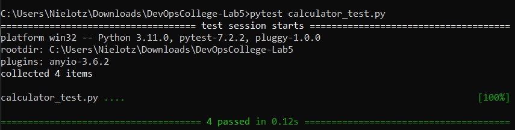
5.5: Stworzono akcję, która uruchomi testy w momencie pusha: 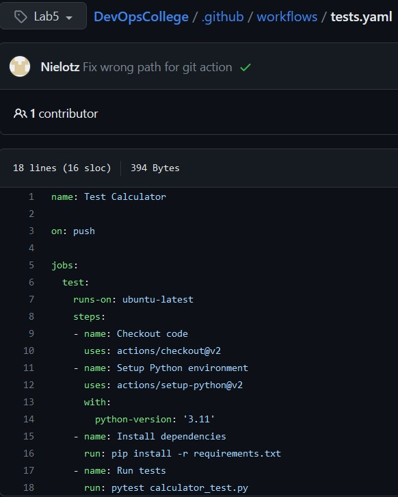
Weryfikacja:
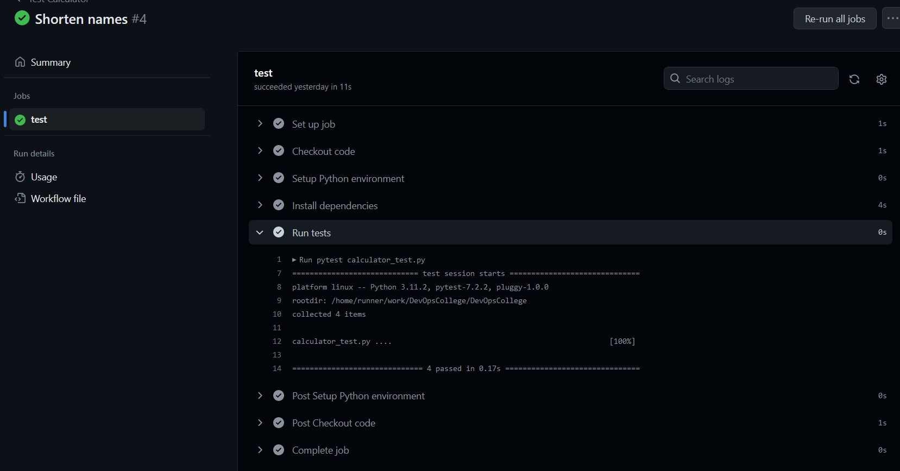
## [Lab 6](https://github.com/Nielotz/DevOpsCollege/tree/Lab6)

6.0: Zmieniono strukturę projektu: 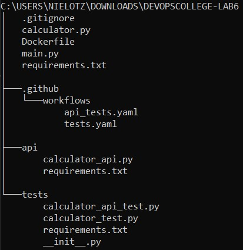
6.1-2: Napisano API używające poprzednich funkcji:
```python
from fastapi import FastAPI, HTTPException

from calculator import sub, div, mul

app = FastAPI()

@app.get("/api/mul")
async def api_mul(a: float, b: float):
    return {"result": mul(a, b)}

@app.get("/api/sub")
async def api_sub(a: float, b: float):
    return {"result": sub(a, b)}

@app.get("/api/div")
async def api_div(a: float, b: float):
    if b == 0:
        raise HTTPException(status_code=400, detail="Cannot divide by zero")
    return {"result": div(a, b)}
```
Uruchamiane za pomocą main.py:
```python
import api.calculator_api as api

import uvicorn
uvicorn.run(api.app, host="0.0.0.0", port=8000)
```
Podzielono requirements.txt tak, aby zminimalizować ilość zależności: 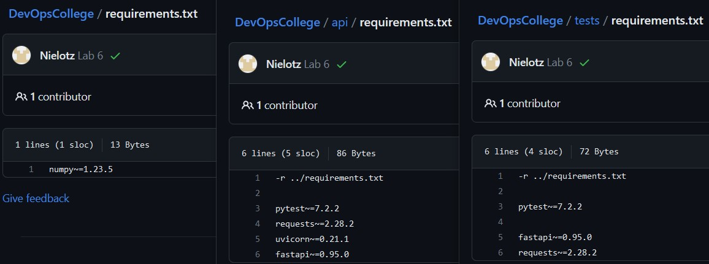

6.3: Napisano testy do każdego endpointa: 
```python
import requests

BASE_URL = "http://localhost:8000"

def test_api_mul():
    url = f"{BASE_URL}/api/mul?a=2&b=3"
    response = requests.get(url)
    assert response.status_code == 200
    assert response.json() == {"result": 6}

def test_api_sub():
    url = f"{BASE_URL}/api/sub?a=10&b=3"
    response = requests.get(url)
    assert response.status_code == 200
    assert response.json() == {"result": 7}

def test_api_div():
    url = f"{BASE_URL}/api/div?a=10&b=5"
    response = requests.get(url)
    assert response.status_code == 200
    assert response.json() == {"result": 2}

    url = f"{BASE_URL}/api/div?a=10&b=0"
    response = requests.get(url)
    assert response.status_code == 400
    assert response.json() == {"detail": "Cannot divide by zero"}
```
6.4: Stworzono Dokerfile, który uruchamia aplikację: 
```Dockerfile
FROM python

RUN python -m pip install pip --upgrade

RUN apt-get update && \
    apt-get upgrade -y && \
    apt-get install -y git && \
    apt-get autoremove -y && \
    apt-get clean

RUN git clone https://github.com/Nielotz/DevOpsCollege.git app

RUN python -m pip install -r app/api/requirements.txt

CMD python app/main.py
```
6.5: Sprawdzono, czy lokalnie działają testy: 
6.6: Stworzono git action:
```yaml
name: Calculator api tests

on:
  push:
    branches:
      - main

jobs:
  test-calculator-api:
    runs-on: ubuntu-latest

    steps:
      - name: Checkout repository
        uses: actions/checkout@v3

      - name: Build Docker image
        run: docker build -t calculator-app .

      - name: Run Docker image
        run: docker run -d -p 8000:8000 calculator-app
        
      - name: Install dependencies
        run: |
          python -m pip install --upgrade pip
          pip install -r tests/requirements.txt

      - name: Setup Python
        uses: actions/setup-python@v2
        with:
          python-version: '3.11'

      - name: Run tests
        run: pytest tests/calculator_api_test.py
```
6.6: Weryfikacja działania: 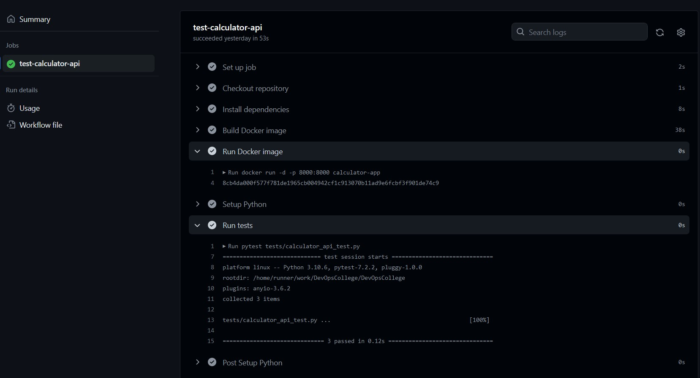

## Lab 7
7.1: Stworzono 3 gałęzie: 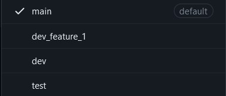
7.2: Dodano akcję uruchamiającą unit testy w momencie pull requesta na dev: 
```yaml
name: Test Calculator

on:
  pull_request:
    branches:
      - dev

jobs:
  test-calculator:
    runs-on: ubuntu-latest

    steps:
      - name: Checkout repository
        uses: actions/checkout@v3

      - name: Setup Python
        uses: actions/setup-python@v2
        with:
          python-version: '3.11'

      - name: Install dependencies
        run: |
          python -m pip install --upgrade pip
          pip install -r tests/requirements.txt
      - name: Run tests
        run: pytest tests/calculator_test.py
```
7.3: Dodano akcję uruchamiającą testy funkcjonalne w momencie pull requesta na test: 
```yaml
name: Calculator api tests

on:
  pull_request:
    branches:
      - test

jobs:
  test-calculator-api:
    runs-on: ubuntu-latest

    steps:
      - name: Checkout repository
        uses: actions/checkout@v3

      - name: Install dependencies
        run: |
          python -m pip install --upgrade pip
          pip install -r tests/requirements.txt
          
      - name: Build Docker image
        run: docker build -t calculator-app .

      - name: Run Docker image
        run: docker run -d -p 8000:8000 calculator-app

      - name: Setup Python
        uses: actions/setup-python@v2
        with:
          python-version: '3.11'

      - name: Run tests
        run: pytest tests/calculator_api_test.py
```
7.4: Dodano akcję uploadującą Dockerfile, uruchamianą w momencie mergowania:
### Nie udało mi się uruchomić w ten sposób (zagnieżdzone uruchamianie):
```yaml
on:
  pull_request:
    branches:
      - test
    types:
      - closed

jobs:
  push-docker-image:
    if: github.event.pull_request.merged
    runs-on: ubuntu-latest
    steps:
    - name: Checkout
      uses: actions/checkout@v3

    - name: Functional Tests
      uses: ./api_tests.yaml

    - name: Login to Docker Hub and push
      env:
        DOCKER_USERNAME: ${{ secrets.DOCKER_USERNAME }}
        DOCKER_PASSWORD: ${{ secrets.DOCKER_TOKEN }}
      run: |
        echo "$DOCKER_PASSWORD" | docker login -u "$DOCKER_USERNAME" --password-stdin
        docker build -t calculator-app .
        docker tag calculator-app ${{ secrets.DOCKER_USERNAME }}/calculator-app:latest
        docker push ${{ secrets.DOCKER_USERNAME }}/calculator-app:latest
```
### Więc copy-paste'owałem yaml testów:
```yaml
on:
  pull_request:
    branches:
      - test
    types:
      - closed

jobs:
  push-docker-image:
    if: github.event.pull_request.merged
    runs-on: ubuntu-latest
    steps:
    - name: Checkout
      uses: actions/checkout@v3

    - name: Install dependencies for tests
      run: |
        python -m pip install --upgrade pip
        pip install -r tests/requirements.txt

    - name: Build Docker image
      run: docker build -t calculator-app .

    - name: Run Docker image
      run: docker run -d -p 8000:8000 calculator-app

    - name: Setup Python
      uses: actions/setup-python@v2
      with:
        python-version: '3.11'

    - name: Run tests
      run: pytest tests/calculator_api_test.py

    - name: Login to Docker Hub and push
      env:
        DOCKER_USERNAME: ${{ secrets.DOCKER_USERNAME }}
        DOCKER_PASSWORD: ${{ secrets.DOCKER_TOKEN }}
      run: |
        echo "$DOCKER_PASSWORD" | docker login -u "$DOCKER_USERNAME" --password-stdin
        docker build -t calculator-app .
        docker tag calculator-app ${{ secrets.DOCKER_USERNAME }}/calculator-app:latest
        docker push ${{ secrets.DOCKER_USERNAME }}/calculator-app:latest

```
7.6.fail W celu zweryfikowania działania dodano zmiany psujące kod na gałęzi dev_feature_1 i spróbowano zmergować do dev: 
7.6.success Naprawiono blokujący błąd oraz zmergowano: 

7.7.fail Spróbowano zmergować dev do test: 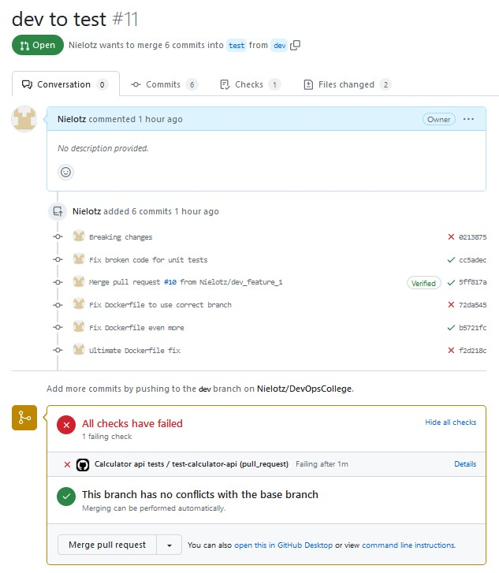
7.7.reason Powód: 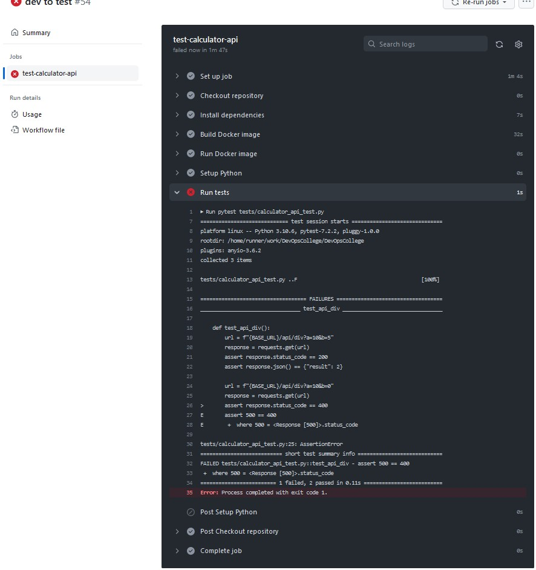
7.7.success Naprawiono blokujący błąd: 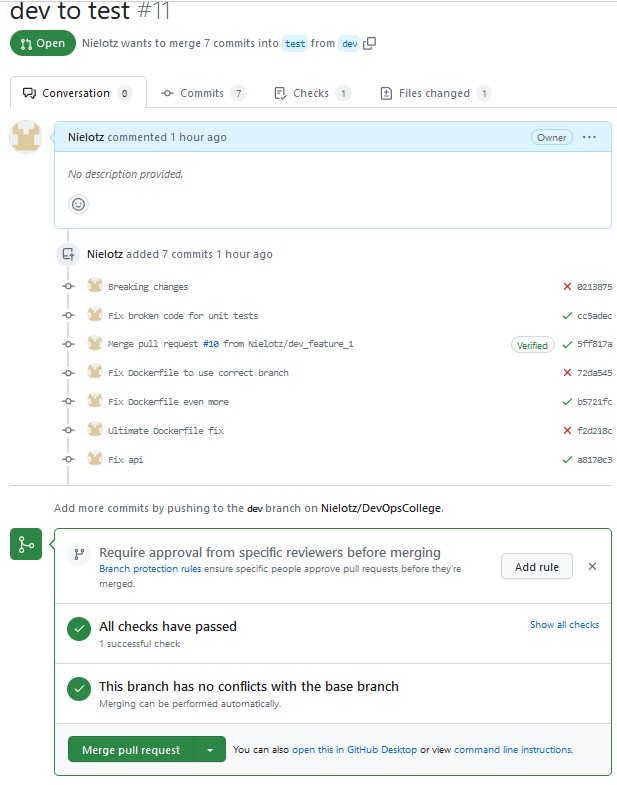
7.7.docker Po zmergowaniu uploadowany jest obraz do repozytorium dockera: 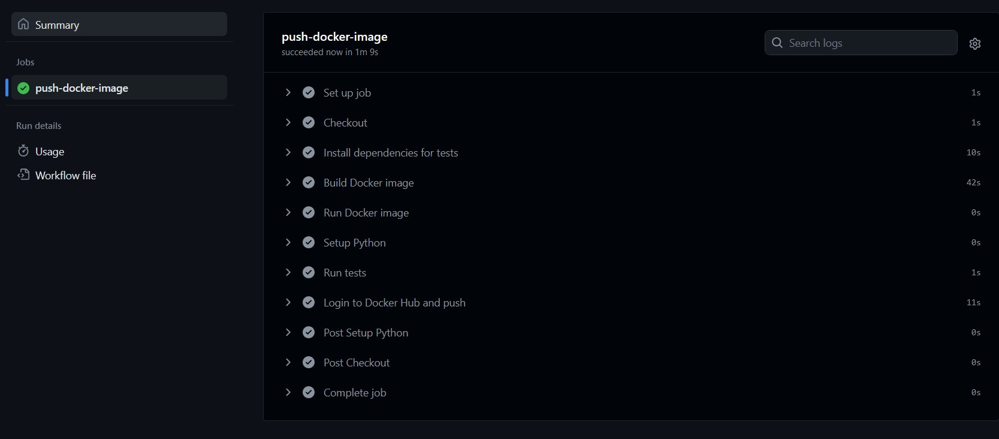 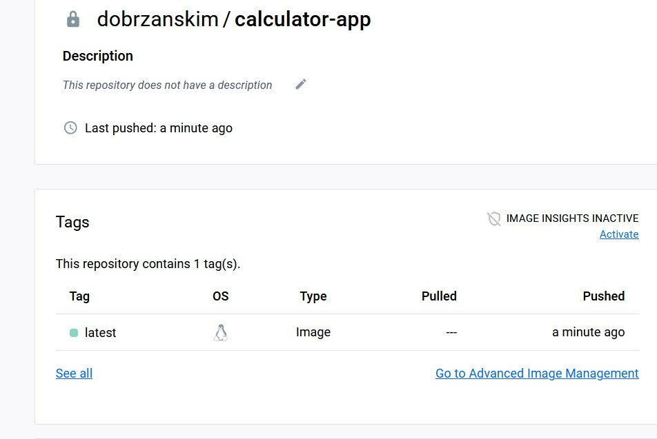